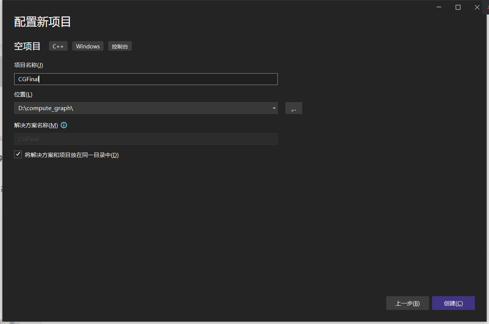
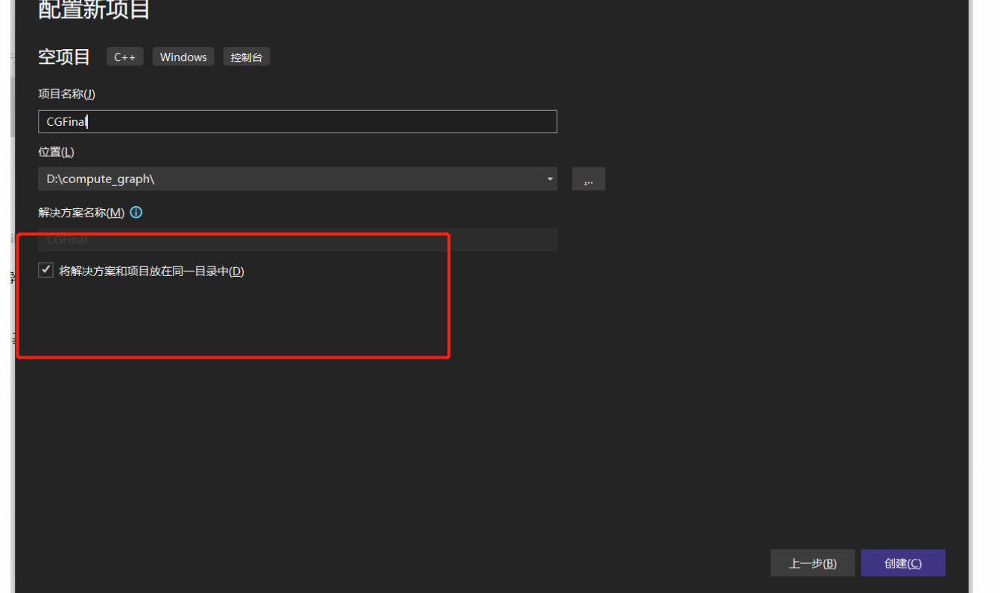
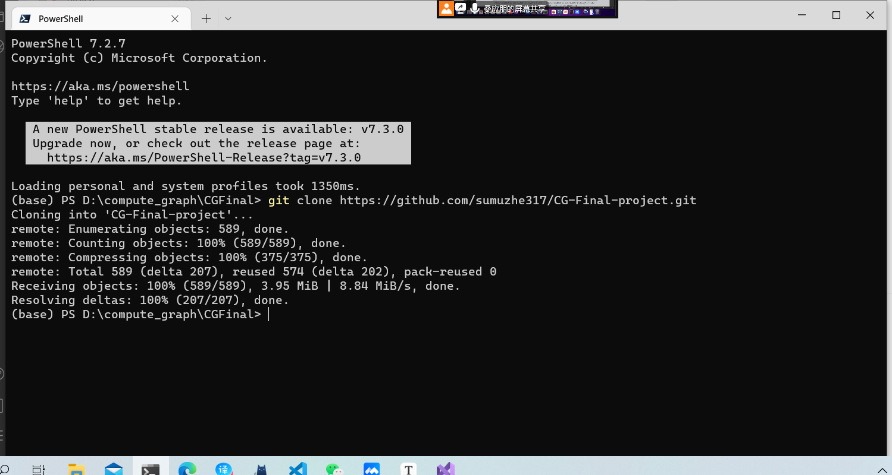
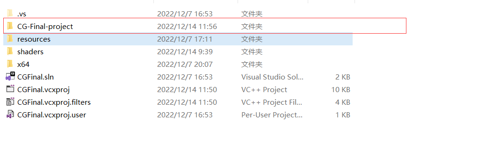
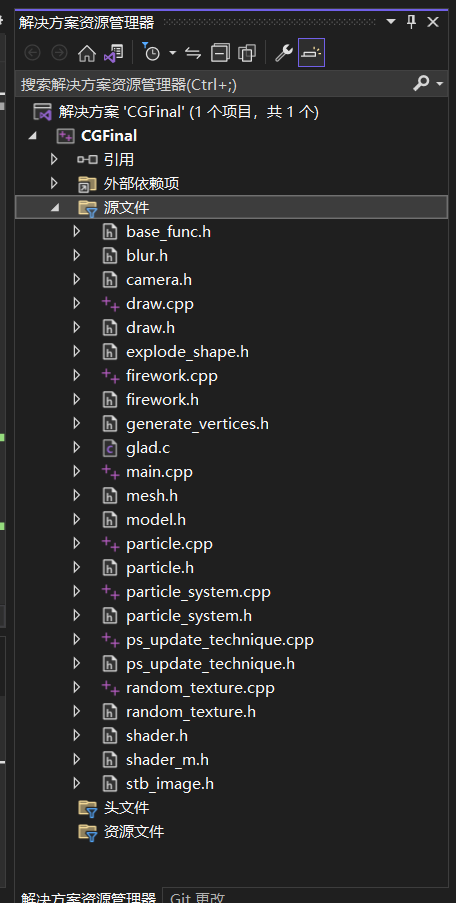
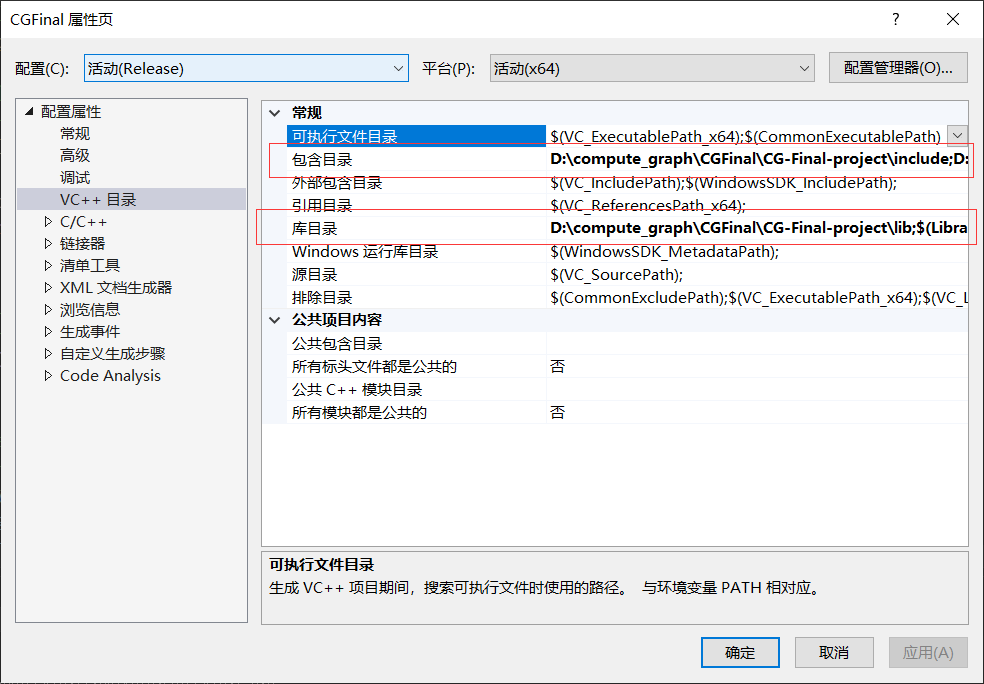
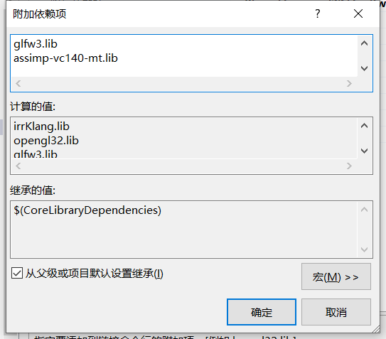
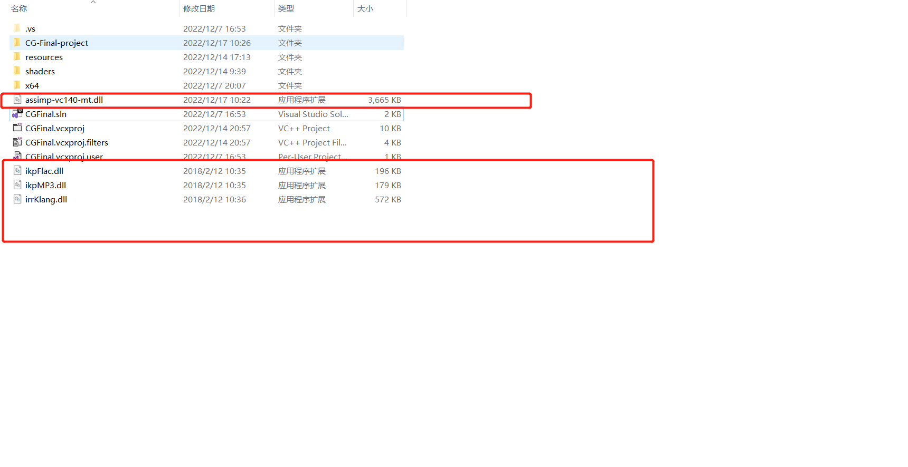

# CG-Final-project

## Example to build the project

本project分为include、lib、resources、shaders、src五个文件夹，作用如名字所示。

构建本项目的例子采用VS 2022，其他IDEA请自行摸索。

我们建议首先创建一个VS的空项目，这里起名为CGFinal，如下图所示：

进去项目文件夹，开始git clone https://github.com/sumuzhe317/CG-Final-project.git

可以看到clone完成了。

在VS 2022里，选择源文件，右键->添加->现有项，进入该project的src目录，ctrl+a全选，点击确定。

配置包含目录，库目录以及链接器依赖项

对CGFinal右键->属性

包含目录包含该project的include文件夹和src文件夹

库目录包含该project的lib文件夹

依赖项添加opengl32.lib，glfw3.lib，irrKlang.lib和assimp-vc140-mt.lib即可

**release 和 debug都在x64下运行，两个都需要设置一遍。**

ctrl+f5运行，然后这时候，把代码里的resources和shaders和几个dll复制出来到项目下即可（包括zip.dll）

如有问题，欢迎联系：1051655293@qq.com